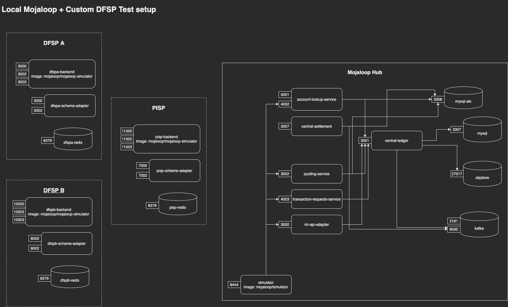

# Local Mojaloop + Custom DFSP Test setup

The aim of this Document is to have a local mojaloop running with two customs DFSPs (backend plus sdk-adapter) and a PISP represented by a mojaloop simulator (which implements mojaloop api).

## Repo layout

Two custom DFSP & PISP configuration
- [`dfsp_a`](./dfsp_a) 
- [`dfsp_b`](./dfsp_b)
- [`pisp`](./pisp)

Backend components
- [`docker`](./docker)

Integration tests
- [`postman`](./postman)

## Context, Parties, Backend components



## Prerequisites
- `docker` - `v18.06.0` or higher
- `docker-compose`. We are using a compose file of `v3.7`. So you need at least `docker-compose` `v1.22`
- `node` and `npm`. We are using `node v12.16.1` at the time of writing
- `newman` You can install globally from npm if you want:
```bash
npm install -g newman
```

or you can install the `node_modules` in the root of this directory
```bash
npm install
```

- A hosts file with the following entries:
```
127.0.0.1       central-ledger.local central-settlement.local ml-api-adapter.local account-lookup-service.local account-lookup-service-admin.local quoting-service.local moja-simulator.local central-ledger central-settlement ml-api-adapter account-lookup-service account-lookup-service-admin quoting-service simulator host.docker.internal
127.0.0.1 dfspa-backend dfspb-backend pisp-backend dfspa-scheme-adapter dfspb-scheme-adapter pisp-scheme-adapter transaction-request-service
```

## Start services using `docker-compose`

```bash
# start all services in background
docker-compose up -d

# Check to see if they are running and healthy
docker-compose ps
```

It may take a little while for the services to healthy.


### Logging:

Use `docker-compose logs -f` to tail the logs of any given container. 

You may want to do this in separate terminal sessions to easily debug each service.

```bash
docker-compose logs -f central-ledger
docker-compose logs -f quoting-service
docker-compose logs -f ml-api-adapter
docker-compose logs -f central-settlement
docker-compose logs -f account-lookup-service
docker-compose logs -f dfspa-scheme-adapter dfspa-backend
docker-compose logs -f dfspb-scheme-adapter dfspb-backend
docker-compose logs -f transaction-requests-service
docker-compose logs -f pisp-backend  pisp-scheme-adapter pisp-redis
```

[todo: update these]
```bash
#Running the services separately in different terminals is recommended

#Run

docker-compose up account-lookup-service #t

# Then close once the service is ready.
# Proceed to stop account-lookup-service and proceed with the following commands.
# ALS needs to be run initially so it setups properly.

# [TODO] is this an ubuntu only issue? Perhaps...

docker-compose up central-ledger
docker-compose up quoting-service
docker-compose up ml-api-adapter
docker-compose up central-settlement
docker-compose up account-lookup-service
docker-compose up dfspa-scheme-adapter dfspa-backend
docker-compose up dfspb-scheme-adapter dfspb-backend
docker-compose up transaction-requests-service
docker-compose up pisp-backend  pisp-scheme-adapter pisp-redis
```

## Create some initial data

### Set Up Seed Data

#### 1. cd to `postman` directory
```bash
cd ./postman
```

#### 2. Run the FullSetup script
Use this convenience script to run all the setup scripts and forgo having to run the setup scripts individually.

```bash
./scripts/setupDockerCompose-FullSetup.sh
```
> This script runs all of the below `setupDockerCompose*` scripts, so you can skip ahead to [Run P2P E2E tests](#13-run-p2p-e2e-tests)


#### 3. Setup hub account

```bash
./scripts/setupDockerCompose-HubAccount.sh
```

```
OSS-New-Deployment-FSP-Setup

❏ Hub Account
↳ Add Hub Account-HUB_MULTILATERAL_SETTLEMENT
  POST http://central-ledger.local:3001/participants/Hub/accounts [201 Created, 511B, 6.2s]
  ✓  Status code is 201

↳ Add Hub Account-HUB_RECONCILIATION
  POST http://central-ledger.local:3001/participants/Hub/accounts [201 Created, 654B, 78ms]
  ✓  Status code is 201

↳ Hub Set Endpoint-SETTLEMENT_TRANSFER_POSITION_CHANGE_EMAIL Copy
  POST http://central-ledger.local:3001/participants/hub/endpoints [201 Created, 129B, 29ms]
  ✓  Status code is 201

↳ Hub Set Endpoint-NET_DEBIT_CAP_ADJUSTMENT_EMAIL Copy
  POST http://central-ledger.local:3001/participants/hub/endpoints [201 Created, 129B, 35ms]
  ✓  Status code is 201

↳ Hub Endpoint-NET_DEBIT_CAP_THRESHOLD_BREACH_EMAIL Copy
  POST http://central-ledger.local:3001/participants/Hub/endpoints [201 Created, 129B, 38ms]
  ✓  Status code is 201

┌─────────────────────────┬────────────────────┬───────────────────┐
│                         │           executed │            failed │
├─────────────────────────┼────────────────────┼───────────────────┤
│              iterations │                  1 │                 0 │
├─────────────────────────┼────────────────────┼───────────────────┤
│                requests │                  5 │                 0 │
├─────────────────────────┼────────────────────┼───────────────────┤
│            test-scripts │                 10 │                 0 │
├─────────────────────────┼────────────────────┼───────────────────┤
│      prerequest-scripts │                  5 │                 0 │
├─────────────────────────┼────────────────────┼───────────────────┤
│              assertions │                  5 │                 0 │
├─────────────────────────┴────────────────────┴───────────────────┤
│ total run duration: 17.2s                                        │
├──────────────────────────────────────────────────────────────────┤
│ total data received: 809B (approx)                               │
├──────────────────────────────────────────────────────────────────┤
│ average response time: 1278ms [min: 29ms, max: 6.2s, s.d.: 2.5s] │
└──────────────────────────────────────────────────────────────────┘
```

#### 4. Setup the oracle for ALS

```bash
./scripts/setupDockerCompose-OracleOnboarding.sh
```

```
OSS-New-Deployment-FSP-Setup

❏ Oracle Onboarding
↳ Register Simulator Oracle for MSISDN
  POST http://account-lookup-service-admin.local:4001/oracles [201 Created, 213B, 5.2s]

┌─────────────────────────┬──────────────────┬──────────────────┐
│                         │         executed │           failed │
├─────────────────────────┼──────────────────┼──────────────────┤
│              iterations │                1 │                0 │
├─────────────────────────┼──────────────────┼──────────────────┤
│                requests │                1 │                0 │
├─────────────────────────┼──────────────────┼──────────────────┤
│            test-scripts │                1 │                0 │
├─────────────────────────┼──────────────────┼──────────────────┤
│      prerequest-scripts │                1 │                0 │
├─────────────────────────┼──────────────────┼──────────────────┤
│              assertions │                0 │                0 │
├─────────────────────────┴──────────────────┴──────────────────┤
│ total run duration: 7.5s                                      │
├───────────────────────────────────────────────────────────────┤
│ total data received: 0B (approx)                              │
├───────────────────────────────────────────────────────────────┤
│ average response time: 5.2s [min: 5.2s, max: 5.2s, s.d.: 0µs] │
└───────────────────────────────────────────────────────────────┘
```

#### 5. Create DFSP A (use SDK + backend)

It will create a new participant with its endpoints and some init data. For this case, name, position, and limits will be

| Parameter | Value |
|-----------|---------|
| `name`       | `dfspa`  |
| `currency`       | `USD`  |
| `limit.type`       | `NET_DEBIT_CAP` |
| `limit.value`   | `1000000` |
| `initialPosition`     | `0` |`

```bash
./scripts/setupDockerCompose-DFSP-A.sh
```

#### 6. Create DFSP B(use SDK + backend)

It will create a new participant with its endpoints and some init data. For this case, name, position, and limits will be

| Parameter | Value |
|-----------|---------|
| `name`       | `dfspb`  |
| `currency`       | `USD`  |
| `limit.type`       | `NET_DEBIT_CAP` |
| `limit.value`   | `1000000` |
| `initialPosition`     | `0` |`

```bash
./scripts/setupDockerCompose-DFSP-B.sh
```
#### 7. Create a Simulator DFSP (implement mojaloop api)

It will create a new participant with its endpoints and some init data. For this case, name, position, and limits will be

| Parameter | Value |
|-----------|---------|
| `name`       | `payeefsp`  |
| `currency`       | `USD`  |
| `limit.type`       | `NET_DEBIT_CAP` |
| `limit.value`   | `1000000` |
| `initialPosition`     | `0` |`

```bash
./scripts/setupDockerCompose-DFSP-SIMULATOR.sh
```
#### 8. Create PISP (use SDK + backend)

It will create a new participant with its endpoints and some init data. For this case, name, position, and limits will be

| Parameter | Value |
|-----------|---------|
| `name`       | `pisp`  |
| `currency`       | `USD`  |
| `limit.type`       | `NET_DEBIT_CAP` |
| `limit.value`   | `1000000` |
| `initialPosition`     | `0` |`

```bash
./scripts/setupDockerCompose-PISP.sh
```

#### 9. Add MSISDN (123456789) for DFSP A

Register a new MSISDN for this dfsp with this initial data

| Parameter | Value |
|-----------|---------|
| `currency`       | `USD`  |


```bash
./scripts/setupDockerCompose-DFSP-A-MSISDN.sh
```

#### 10. Add MSISDN (987654321) for DFSP B

Register a new MSISDN for this dfsp with this initial data

| Parameter | Value |
|-----------|---------|
| `currency`       | `USD`  |

```bash
./scripts/setupDockerCompose-DFSP-B-MSISDN.sh
```

#### 11. Add MSISDN (333333333) for Simulator

Register a new MSISDN for this dfsp with this initial data

| Parameter | Value |
|-----------|---------|
| `currency`       | `USD`  |

```bash
./scripts/setupDockerCompose-DFSP-SIMULATOR-MSISDN.sh
```

#### 12. Add MSISDN (999999999) for PISP

Register a new MSISDN for this dfsp with this initial data

| Parameter | Value |
|-----------|---------|
| `currency`       | `USD`  |

```bash
./scripts/setupDockerCompose-PISP-MSISDN.sh
```

#### 13. Add parties to the backends of DFSP A, DFSP B and PISP.

```bash
./scripts/setupDockerCompose-dfsp-backend-parties.sh
```

#### 13. Run P2P E2E tests.


```bash
./scripts/testE2ETransfers.sh
```

#### 14. Run PISP E2E tests.

```bash
./scripts/test-E2E-transaction-req-initiated-by-PISP.sh
```


> **Note: Restarting `docker-compose`**
>
> If you restart docker compose you'll need to re-run this command to setup ALS
```bash
./scripts/setupDockerCompose-DFSP-B-MSISDN.sh && \
  ./scripts/setupDockerCompose-DFSP-A-MSISDN.sh && \
  ./scripts/>setupDockerCompose-DFSP-SIMULATOR-MSISDN.sh && \
  ./scripts/setupDockerCompose-PISP-MSISDN.sh
```

## P2P Examples

### 1. Transfer USD 100 from MSISDN 123456789 (DFSP A) to MSISDN 987654321 (DFSP B)

```bash
curl -v -X POST http://localhost:9003/scenarios   -H 'Content-Type: application/json'  -d '[
    {
        "name": "scenario1",
        "operation": "postTransfers",
        "body": {
            "from": {
                "idType": "MSISDN",
                "idValue": "123456789"
            },
            "to": {
                "idType": "MSISDN",
                "idValue": "987654321"
            },
            "amountType": "SEND",
            "currency": "USD",
            "amount": "100",
            "transactionType": "TRANSFER",
            "note": "Test note",
            "homeTransactionId": "123ABC"
        }
    }
]'
```

#### Response: Transfer was completed
```json
{
    "scenario1": {
        "result": {
            "from": {
                "idType": "MSISDN",
                "idValue": "123456789"
            },
            "to": {
                "idType": "MSISDN",
                "idValue": "987654321",
                "fspId": "dfspb",
                "firstName": "Bob",
                "middleName": "O",
                "lastName": "Babirusa",
                "dateOfBirth": "1970-01-01"
            },
            "amountType": "SEND",
            "currency": "USD",
            "amount": "100",
            "transactionType": "TRANSFER",
            "note": "Test note",
            "homeTransactionId": "123ABC",
            "transferId": "b3566a13-a80a-463e-8f7e-dea718a1c97d",
            "currentState": "COMPLETED",
            "quoteId": "69ab32ba-5cbe-4640-8399-565a6763b557",
            "quoteResponse": {
                "transferAmount": {
                    "amount": "100",
                    "currency": "USD"
                },
                "expiration": "2020-05-06T21:17:34.779Z",
                "ilpPacket": "AYIC-wAAAAAAACcQGGcuZGZzcGIubXNpc2RuLjk4NzY1NDMyMYIC1mV5SjBjbUZ1YzJGamRHbHZia2xrSWpvaVlqTTFOalpoTVRNdFlUZ3dZUzAwTmpObExUaG1OMlV0WkdWaE56RTRZVEZqT1Rka0lpd2ljWFZ2ZEdWSlpDSTZJalk1WVdJek1tSmhMVFZqWW1VdE5EWTBNQzA0TXprNUxUVTJOV0UyTnpZellqVTFOeUlzSW5CaGVXVmxJanA3SW5CaGNuUjVTV1JKYm1adklqcDdJbkJoY25SNVNXUlVlWEJsSWpvaVRWTkpVMFJPSWl3aWNHRnlkSGxKWkdWdWRHbG1hV1Z5SWpvaU9UZzNOalUwTXpJeElpd2labk53U1dRaU9pSmtabk53WWlKOUxDSndaWEp6YjI1aGJFbHVabThpT25zaVkyOXRjR3hsZUU1aGJXVWlPbnNpWm1seWMzUk9ZVzFsSWpvaVFtOWlJaXdpYldsa1pHeGxUbUZ0WlNJNklrOGlMQ0pzWVhOMFRtRnRaU0k2SWtKaFltbHlkWE5oSW4wc0ltUmhkR1ZQWmtKcGNuUm9Jam9pTVRrM01DMHdNUzB3TVNKOWZTd2ljR0Y1WlhJaU9uc2ljR0Z5ZEhsSlpFbHVabThpT25zaWNHRnlkSGxKWkZSNWNHVWlPaUpOVTBsVFJFNGlMQ0p3WVhKMGVVbGtaVzUwYVdacFpYSWlPaUl4TWpNME5UWTNPRGtpTENKbWMzQkpaQ0k2SW1SbWMzQmhJbjE5TENKaGJXOTFiblFpT25zaVlXMXZkVzUwSWpvaU1UQXdJaXdpWTNWeWNtVnVZM2tpT2lKVlUwUWlmU3dpZEhKaGJuTmhZM1JwYjI1VWVYQmxJanA3SW5OalpXNWhjbWx2SWpvaVZGSkJUbE5HUlZJaUxDSnBibWwwYVdGMGIzSWlPaUpRUVZsRlVpSXNJbWx1YVhScFlYUnZjbFI1Y0dVaU9pSkRUMDVUVlUxRlVpSjlmUQA",
                "condition": "DOD2qgwCJuMIIzrGmZfJ7GDVPmr2xoBmkrBoRT9ourU",
                "payeeFspFee": {
                    "amount": "5",
                    "currency": "USD"
                },
                "payeeFspCommission": {
                    "amount": "5",
                    "currency": "USD"
                }
            },
            "quoteResponseSource": "dfspb",
            "fulfil": {
                "completedTimestamp": "2020-05-06T21:16:34.871Z",
                "transferState": "COMMITTED",
                "fulfilment": "H_Xod2AWCi2H0aCqkBTrPaU63BH_9n6Rca57O8Qgjkk"
            }
        }
    }
}
```

### 2. Transfer USD 90 from MSISDN 123456789 (DFSP A) to MSISDN 333333333 (Simulator)

```bash
curl -v -X POST http://localhost:9003/scenarios   -H 'Content-Type: application/json'  -d '[
  {
    "name": "scenario1",
    "operation": "postTransfers",
    "body": {
      "from": {
          "idType": "MSISDN",
          "idValue": "123456789"
      },
      "to": {
          "idType": "MSISDN",
          "idValue": "333333333"
      },
      "amountType": "SEND",
      "currency": "USD",
      "amount": "90",
      "transactionType": "TRANSFER",
      "note": "test",
      "homeTransactionId": "123ABC"
    }
  }
]'
```

## PISP Transaction Request Examples


### 1. `POST /requestToPay`

> Note: The HTTP request `POST /requestToPay` has two stages, (1) Party Lookup and (2) Initiate Transaction Request

```bash
curl -v  -X  POST http://localhost:7002/requestToPay  -H  'Content-Type: application/json'  -d  '{
    "homeTransactionId": "f0cf62e7-fb15-46a5-9525-37f934d98fcd",
    "from": {
        "idType": "MSISDN",
        "idValue": "987654321"
    },
    "to": {
        "idType": "MSISDN",
        "idValue": "123456789"
    },
    "amountType": "SEND",
    "currency": "USD",
    "amount": "18",
    "scenario":"PAYMENT",
    "initiator":"PAYEE",
    "initiatorType":"BUSINESS",
    "note": "pisp test payment"
}'
```

##### `POST /requestToPay` Response:
````json
{
    "homeTransactionId": "f0cf62e7-fb15-46a5-9525-37f934d98fcd",
    "from": {
        "idType": "MSISDN",
        "idValue": "987654321",
        "fspId": "pisp"
    },
    "to": {
        "idType": "MSISDN",
        "idValue": "123456789",
        "fspId": "dfspa",
        "firstName": "Alice",
        "middleName": "K",
        "lastName": "Alpaca",
        "dateOfBirth": "1970-01-01"
    },
    "amountType": "SEND",
    "currency": "USD",
    "amount": "18",
    "scenario": "PAYMENT",
    "initiator": "PAYEE",
    "initiatorType": "BUSINESS",
    "note": "pisp test payment",
    "transactionRequestId": "70c522c9-0880-40b1-b28f-0c567e0b39aa",
    "currentState": "COMPLETED",
    "requestToPayState": "RECEIVED"
}
````

### 2. `POST /requestToPayTransfer`

> The HTTP request `POST /requestToPayTransfer` is used to request the movement of funds from payer DFSP to payee DFSP.
> The underlying Mojaloop API has three stages for money transfer: (1) Quotation, (2) Authorization and (3) Transfer

```bash
curl -v  -X  POST http://localhost:5002/requestToPayTransfer  -H  'Content-Type: application/json' -d '{
  "requestToPayTransactionId": "70c522c9-0880-40b1-b28f-0c567e0b39aa",
  "from": {
    "idType": "MSISDN",
    "idValue": "123456789"
  },
  "to": {
    "idType": "MSISDN",
    "idValue": "987654321",
    "fspId":"dfspb"
  },
  "amountType": "SEND",
  "currency": "USD",
  "amount": "18",
  "scenario":"PAYMENT",
  "initiator":"PAYEE",
  "initiatorType":"BUSINESS",
  "note": "pisp test payment"
}'
```

##### `POST /requestToPayTransfer` Response:
```json
{
    "requestToPayTransactionId": "70c522c9-0880-40b1-b28f-0c567e0b39aa",
    "from": {
        "idType": "MSISDN",
        "idValue": "123456789"
    },
    "to": {
        "idType": "MSISDN",
        "idValue": "987654321",
        "fspId": "dfspb"
    },
    "amountType": "SEND",
    "currency": "USD",
    "amount": "18",
    "scenario": "PAYMENT",
    "initiator": "PAYEE",
    "initiatorType": "BUSINESS",
    "note": "pisp test payment",
    "transferId": "ab3532c6-7ca3-461d-b2b9-4235085e7f6e",
    "currentState": "WAITING_FOR_QUOTE_ACCEPTANCE",
    "quoteId": "17467236-b6fe-4487-b21d-db9d37fd9128",
    "quoteResponse": {
        "transferAmount": {
            "amount": "18",
            "currency": "USD"
        },
        "expiration": "2020-05-12T09:26:13.967Z",
        "ilpPacket": "<removed for brevity>",
        "payeeFspFee": {
            "amount": "0",
            "currency": "USD"
        },
        "payeeFspCommission": {
            "amount": "0",
            "currency": "USD"
        }
    },
    "quoteResponseSource": "dfspb"
}
```

### 3. `POST /requestToPayTransfer/{requestToPayTransactionId}:`

>The HTTP request `POST /requestToPayTransfer/{requestToPayTransactionId}` is used to Continues a transfer that has paused at the authorization stage in order to accept quote

```bash
curl -v  -X  \ POST http://localhost:5002/requestToPayTransfer/70c522c9-0880-40b1-b28f-0c567e0b39aa  -H  'Content-Type: application/json'  -d  '{
       "acceptQuote": true
}'

```
##### `POST /requestToPayTransfer/{requestToPayTransactionId}` Response:
```json
{
    "requestToPayTransactionId": "70c522c9-0880-40b1-b28f-0c567e0b39aa",
    "from": {
        "idType": "MSISDN",
        "idValue": "123456789"
    },
    "to": {
        "idType": "MSISDN",
        "idValue": "987654321",
        "fspId": "dfspb"
    },
    "amountType": "SEND",
    "currency": "USD",
    "amount": "18",
    "scenario": "PAYMENT",
    "initiator": "PAYEE",
    "initiatorType": "BUSINESS",
    "note": "pisp test payment",
    "transferId": "ab3532c6-7ca3-461d-b2b9-4235085e7f6e",
    "currentState": "COMPLETED",
    "quoteId": "17467236-b6fe-4487-b21d-db9d37fd9128",
    "quoteResponse": {
        "transferAmount": {
            "amount": "18",
            "currency": "USD"
        },
        "expiration": "2020-05-12T09:26:13.967Z",
        "ilpPacket": "<removed for brevity>",
        "payeeFspFee": {
            "amount": "0",
            "currency": "USD"
        },
        "payeeFspCommission": {
            "amount": "0",
            "currency": "USD"
        }
    },
    "quoteResponseSource": "dfspb",
    "fulfil": {
        "completedTimestamp": "2020-05-12T09:25:27.227Z",
        "transferState": "COMMITTED",
        "fulfilment": "PjQaZGeBajwGGv-Oqa2F-gYX21ngMVJZOLc6hxNDS74"
    }
}
```