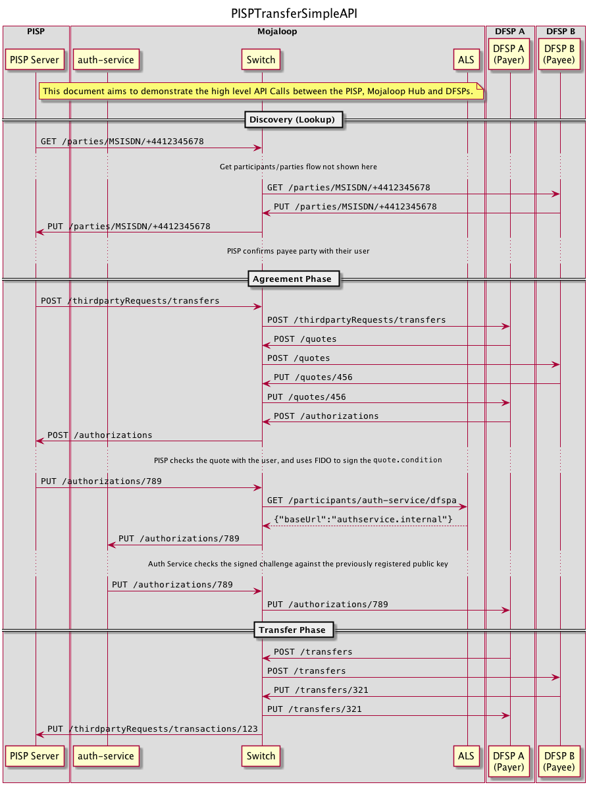

# pisp/docs

Supporting documentation for the PISP implementation.

## Overview
- [Sequence Diagrams](#sequence-diagrams)
  - [Linking Steps](#linking)
      - [Linking List of Endpoints](#linking---endpoints)
  - [Transfer Steps](#transfer)
    - [Transfer List of Endpoints](#transfer---endpoints)
- [Design Decisions](./design-decisions/README.md)
- [Proposed Error Codes](./error_codes.md)
- [Git Branching Strategy](./git_branching.md)
- [Mojaloop Roles + Endpoints](./roles_and_endpoints.md)
- [Tools](#tools)

## Sequence Diagrams

### Linking

> Note: This section is currently under revision as of 19/05/2020. Expect changes.

#### 1. Discovery

#### 2a. Authentication - Web

#### 3a. Delegation & Consent - Web Option

#### 4a. FIDO Registration - Web Option

#### 2b. Authentication - SMS Option

#### 3b. Delegation & Consent - SMS Option

#### 4b. FIDO Registration - SMS Option

#### Linking - Endpoints 

> Note: The linking endpoint list is still a work in progress, and is blocked by [#280](https://app.zenhub.com/workspaces/pisp-5e8457b05580fb04a7fd4878/issues/mojaloop/mojaloop/280)

`DISC-C GET /participants/role/pisp`

** does the callback url need to be validated by the switch?
** in delegaction, can the consent/consentRequest time out? 
** what happens if the user doesn't give consent?

### Transfer
Edit the transfer flow `.puml` files here: [PISP Transfer Api Calls Detailed](./transfer/api_calls_detailed.puml)

> Puml source: [`./transfer/api_calls_simple.puml`]

For a more detailed breakdown of the api calls, Refer to the detailed API flows:
 - [Discovery](./out/transfer/api_calls_detailed/PISPTransferDetailedAPI-page1.png)
 - [Agreement](./out/transfer/api_calls_detailed/PISPTransferDetailedAPI-page2.png)
 - [Transfer](./out/transfer/api_calls_detailed/PISPTransferDetailedAPI-page3.png)

## Tools

To update the sequence diagrams in `./docs/out`, ensure you have the [PlantUML vscode plugin](https://marketplace.visualstudio.com/items?itemName=jebbs.plantuml&ssr=false#overview) installed.

1. `CMD + Shift + P`
2. Select `PlantUML: Export Workspace Diagrams`
3. Wait for the export to complete, and commit the changes
