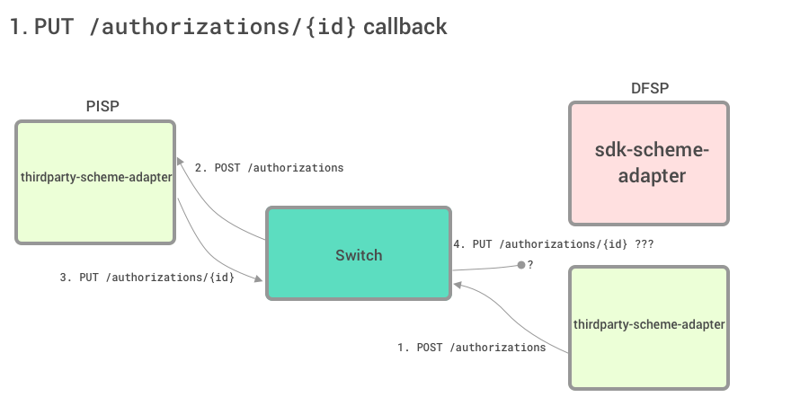
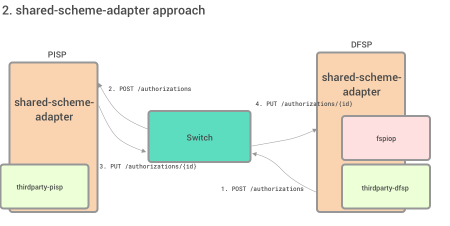
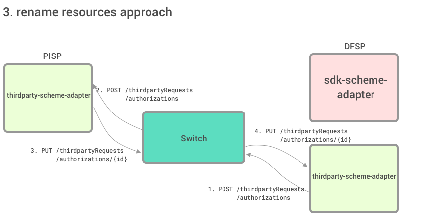
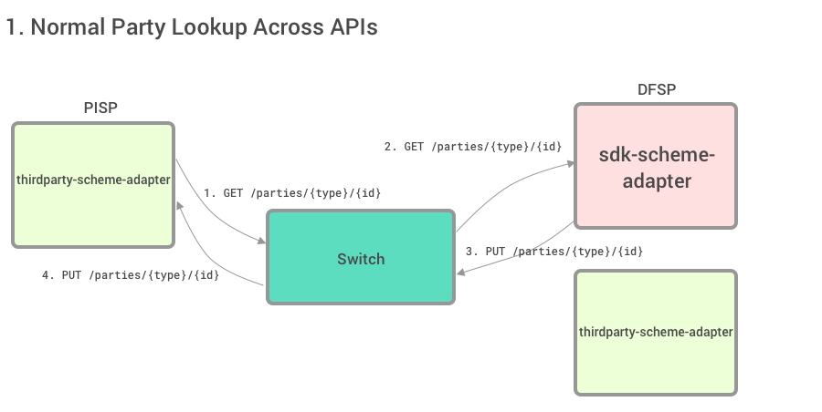
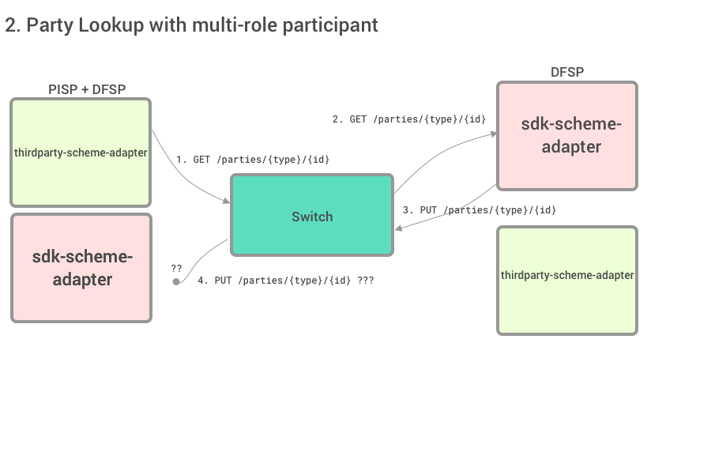
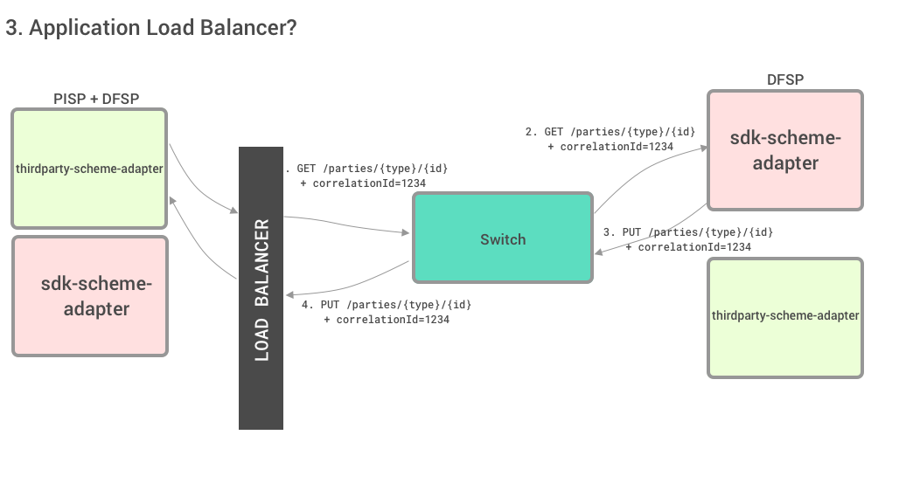

# Addressing API Resource Collision in a Multi-API World

## Background

- We now have _other_ apis - the first of which are the Thirdparty-APIs (Thirdparty-PISP and Thirdparty-DFSP)
- These APIs are closely related to the FSPIOP-API, such that some resources are shared between the APIs
- In the context of our DA discussion around making a separate _thirdparty-scheme-adapter_, issues around collision, and routing became apparent. See [mojaloop/design-authority/issues/51](https://github.com/mojaloop/design-authority/issues/51) for more information.

## The Question

**In our multi-api world, how can we ensure that callbacks from the switch get to the right place for shared resources?**

This question is relevant now, for the PISP implementation, but also for the future, where we wish to make _more_ APIs that complement and extend Mojaloop's use cases. 

## Shared Resources

### Thirdparty-PISP-API

#### PISP -> Switch

- `GET /parties/{type}/{id}`
- `GET /parties/{type}/{subtype}/{id}`
- `PUT /authorizations/{id}`

#### Switch -> PISP

- `PUT /parties/{type}/{id}`
- `PUT /parties/{type}/{subtype}/{id}`
- `PUT /parties/{type}/{id}/error`
- `PUT /parties/{type}/{subtype}/{id}/error`
- `PUT /authorizations/{id}/error`

### Thirdparty-DFSP-API

#### DFSP -> Switch

- N/A

#### Switch -> DFSP

- `GET /parties/{type}/{id}`
- `GET /parties/{type}/{subtype}/{id}`
- `PUT /authorizations/{id}`

## Example 1 - `PUT /authorizations/{id}`

### 1.1 Default Case

DFSP must handle inbound `PUT /authorizations/{id}` to progress a PISP transfer, but how can it know if this is for a FSPIOP-API transaction request or PISP Thirdparty-API transaction request?

1. DFSP calls `POST /authorizations` to request PISP to authorize the transaction
2. Switch forwards this to the PISP
3. PISP calls `PUT /authorizations/{id}` with user signed transaction
4. Since this resource collides with the FSPIOP-API `PUT /authorizations/{id}`, the switch (by default) forwards it to the DFSP's FSPIOP-API

### 1.2 How about shared scheme adapters?

We could have a single scheme adapter, which is more configurable to turn off or on different apis. I don't like this approach since it strongly dictates the architecture of the PISP/DFSP. It essentially shifts the API naming issue to a different place. A similar approach would be to use an application load balancer, which we will explore below.

### 1.3 Let's just not use shared resource names

I think this makes sense in this case, where we are perhaps overloading a single resource across apis for subtly different purposes. I don't think it makes sense in other cases however.

## Example 2 - `PUT /parties/{type}/{id}` for a DFSP that is also a PISP

### 2.1 Default case -  A simple Party lookup from a PISP

This is fine, and everyone is happy with shared resource names in this case.

### 2.2 What if a DFSP is also a PISP?

This case is not yet applicable, but we have said that a PISP is a _role_ that a participant can assume, similarly with our cross network discussions for CNP and FXP.

So if we have the case where a DFSP _is also_ a PISP, they must support 3 sets of APIs:
- FSPIOP-API
- Thirdparty-DFSP-API
- Thirdparty-PISP-API

Say this participant-who-is-a-DFSP-and-PISP wishes to initiate a Thirdparty Transaction Request (functioning as a PISP). They would do the following:

1. `GET /parties/{type}/{id}` - to look up the account details that their user wishes to send to
2. The switch processes this in the normal way... ALS lookups take place, downstream requests occour
3. The switch then issues a `PUT /parties/{type}/{id}` callback to the participant

**Now: to where should this callback go? To the participant's `FSPIOP-API` handler, or the `Thirdparty-PISP-API` handler?**

### 2.3 We could use an application load balancer....

But I don't know how much the API design should dictate the Participant's infrastructure design. Ideally they should be agnostic.

