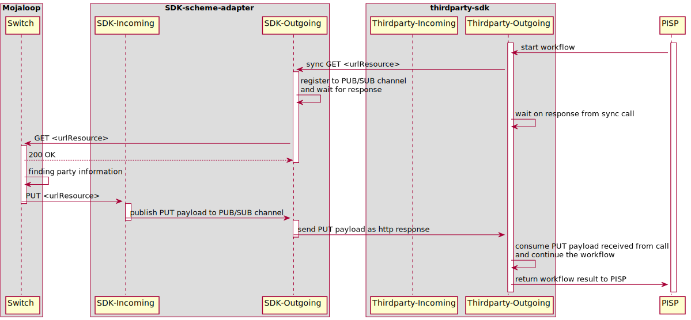

# Scheme Adapters: SDK & Thirdparty

## layout of sdk-scheme-adapter and thridparty-scheme-adapter

## exposing synchronous API endpoints at SDK-Outgoing interface

> pattern of exposing the asynchronous GET/POST -> PUT sequence of calls/callbacks into one synchronous call interface on Outgoing sdk-scheme-adapter

- sync API - synchronous api endpoints to be used by thirdparty scheme-adapter
  
### list of endpoints to be exposed

> **=>** Outgoing  
> **<=** Incoming

#### Linking flow

**Discovery**
- => GET /parties/{Type}/{ID} <= PUT /parties/{Type}/{ID}
  
**Request consent**
- => POST /consentRequests <= PUT /consentRequests/{ID}

**Authentication**
- => PUT /consentRequests/{ID}

**Grant consent**
- => POST /consents <= POST /consents

**Credential registration**
- => POST /consents/{ID}/generateChallenge <= PUT /consents/{ID}` 
  
#### Unlinking flow
- => POST /consents/{ID}/revoke <= PATCH /consents/{ID}
  
### Thirdparty credential registration
- TODO

#### Transfer flow

**Discovery lookup phase**
- => GET /parties/{Type}/{ID} <= PUT /parties/{Type}/{ID}

**Agreement phase**
- => POST /quotes <= PUT /quotes/{ID}
- => POST /authorizations <= PUT /authorizations/{ID}
- => POST /thirdpartyRequests/transactions/{ID}/authorizations <= PUT /thirdpartyRequests/transactions/{ID}/authorizations

**Transfer phase**
- => POST /transfers <= PUT /transfers/{ID}
- <= PATCH /thirdpartyRequests/transactions/{ID}
