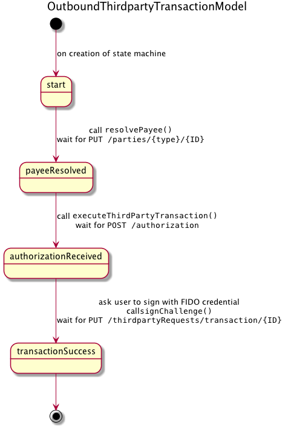
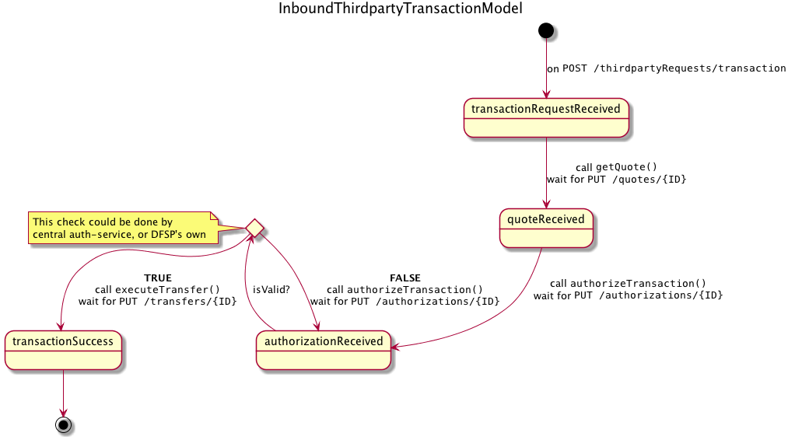

# Scheme Adapter Changes

A design document to explain/discuss the changes required in the `sdk-scheme-adapter` to implement PISP functionality.

## Scheme Adapter Background

One of the purposes of the `sdk-scheme-adapter` is to abstract away the Mojaloop API's async nature to make integrations easier. In addition, we use the scheme adapter as part of the `mojaloop-simulator`, so in order to prove and test our solution, we need to add functionality to the `mojaloop-simulator`, and hence the `sdk-scheme-adapter`.

### State Machines

The `sdk-scheme-adapter` uses a series of state machines, implemented using the [javascript-state-machine](https://github.com/jakesgordon/javascript-state-machine) library. These state machines make it possible to handle complex async calls to a mojaloop hub, and expose them as a simpler, syncronous API to DFSPs and the `mojaloop-simulator` alike.

Below we propose a number of new state machines to be implemented as a part of the PISP functionality. Keep in mind the names are not set in stone, this is very much a first pass and will be expected to change.

#### OutboundThirdpartyTransactionModel

**Purpose:**   
Models the PISP side of a PISP transaction, starting with a `GET /parties`, all the way to the `PUT /thirdpartyRequests/transaction/{ID}` callback.

**Model:**  

**States:**
- `start` - when the state machine is created
- `payeeResolved` - on a `PUT /parties/{type}/{ID}`
- `authorizationReceived` - on a `POST /authorization`
- `transactionSuccess` - on a `PUT /thirdpartyRequests/transaction/{ID}`
- `error` - on any error callback, or internal processing error

**Functions:**
- `resolvePayee()` - Calls `GET /parties/{type}/{ID}` to lookup the payee party of the transaction
- `executeThirdPartyTransaction()` - Calls `POST /thirdpartyRequests/transaction` to kick off the PISP Transaction
- `signChallenge()` - Calls `PUT /authorizations/{ID}` with the signed challenge from the user

#### InboundThirdpartyTransactionModel

**Purpose:** 
Models the DFSP side of a PISP transaction, initiated by receiving a `POST /thirdpartyRequests/transaction`

**Model:**  

**States:**
- `transactionRequestReceived` - on a `POST /thirdpartyRequests/transaction`
- `quoteReceived` - on a `PUT /quotes/{ID}`
- `authorizationReceived` - on a `PUT /authorizations/{ID}`, with a signed challenge
- `transactionSuccess` - on a `PUT /transfers/{ID}`
- `error` - on any error callback, or internal processing error

**Functions:**
- `getQuote()` - Calls `POST /quotes` to ask the payee for a quote for the given transaction
- `authorizeTransaction()` - Calls `POST /authorizations` to ask the PISP to ask their user to authorize the transaction with their FIDO credential
- `executeTransfer()` - Calls `POST /transfer` to execute the transfer

## Questions:

- How do we handle authorization retries in the above models? Maybe we can leave this for now.