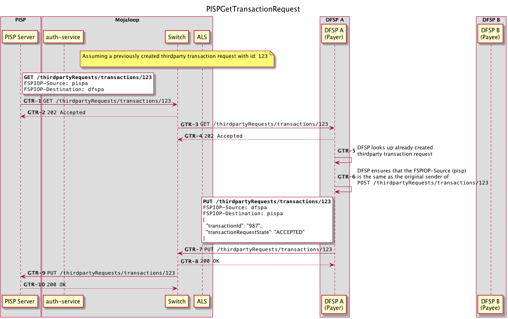

## Transfer API

### Happy Path

Edit the transfer flow `.puml` files here: [PISP Transfer Api Calls Detailed](./api_calls_detailed.puml)


> Puml source: [`./transfer/api_calls_simple.puml`](./transfer/api_calls_simple.puml)

For a more detailed breakdown of the api calls, Refer to the detailed API flows:
 - [Discovery](../out/transfer/api_calls_detailed/PISPTransferDetailedAPI-page1.png)
 - [Agreement](../out/transfer/api_calls_detailed/PISPTransferDetailedAPI-page2.png)
 - [Transfer](../out/transfer/api_calls_detailed/PISPTransferDetailedAPI-page3.png)


### Request TransactionRequest Status

A PISP can issue a `GET /thirdpartyRequests/{id}/transactions` to find the status of a transaction request.



1. PISP issues a `GET /thirdpartyRequests/transactions/{id}`
1. Switch validates request and responds with `202 Accepted`
1. Switch looks up the endpoint for `dfspa` for forwards to DFSP A
1. DFSPA validates the request and responds with `202 Accepted`
1. DFSP looks up the transaction request based on it's `transactionRequestId` (`123` in this case)
    - If it can't be found, it calls `PUT /thirdpartyRequests/transactions/{id}/error` to the Switch, with a relevant error message

1. DFSP Ensures that the `FSPIOP-Source` header matches that of the originator of the `POST //thirdpartyRequests/transactions`
    - If it does not match, it calls `PUT /thirdpartyRequests/transactions/{id}/error` to the Switch, with a relevant error message

1. DFSP calls `PUT /thirdpartyRequests/transactions/{id}` with the following request body:
    ```
    {
      transactionId: <transactionId>
      transactionRequestState: TransactionRequestState
    }
    ```

    Where `transactionId` is the DFSP-generated id of the transaction, and `TransactionRequestState` is `RECEIVED`, `PENDING`, `ACCEPTED`, `REJECTED`, as defined in [7.5.10 TransactionRequestState](https://docs.mojaloop.io/mojaloop-specification/documents/API%20Definition%20v1.0.html#7510-transactionrequeststate) of the API Definition


1. Switch validates request and responds with `200 OK`
1. Switch looks up the endpoint for `pispa` for forwards to PISP
1. PISP validates the request and responds with `200 OK`

### Error Conditions


The PayerDFSP is responsible for communicating failures to the PISP

1. Thirdparty Transaction Request fails

2. Downstream Quote Failure

3. Authorization Failure

4. Transfer Failure


[ todo: in mojaloop/mojaloop#346 ]
