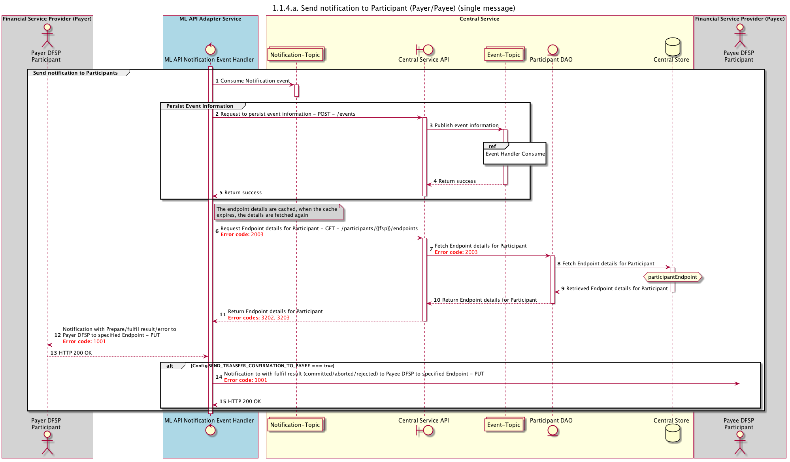

# Transfer Outcome Notification

[#273](https://app.zenhub.com/workspaces/pisp-5e8457b05580fb04a7fd4878/issues/mojaloop/mojaloop/273) As a `PISP` I want to `be informed of the outcome of a transaction` so that `I can inform my customer`.

- Will use the `PUT /thirdPartyRequest/transfer/{ID}`
- The switch will initiate this call (not the DFSP)
- The challenge here is how the switch will know that a given transfer relates to a `thirdPartyRequest/transfer/{ID}`

## Questions:
- How will we implement these notifications?
  - The existing notifications (to Payer and Payee DFSPS) are taken from the `notifications` topic by the ml-api-adapter
  - As the current `PUT /transfer/{ID}` notifications live in the `ml-api-adapter`, it makes sense for the new PISP notifications to also live here
  - Depending on the [_new ThirdParty-API design decision_](./design-decisions/README.md), we could put this functionality in a `thirdparty-api-adapter`
  - For now, let's just say we are going to use the `ml-api-adapter`

- Where should the lookup (to get from a `Transfer.quoteId` -> `ThirdPartyRequestId`) logic live? I think the existing ml-api-adapter has no real state attached to it, and has to talk to `central-ledger`
  - Do we _really_ want to be storing stuff about thirdPartyRequests in the central-ledger? That sounds like a bad idea.
  - Perhaps if we implement this separately in a `thirdparty-api-adapter`, it doesn't need to be stateless

- Does it make sense to have a more generic implementation to contain both the `v1.1` `PATCH` changes and the `PUT /thirdPartyRequest/transfer/{ID}`?
  - This is what Michael suggested originally, and the answer to this probably depends on the decision on whether or not we use a new ThirdParty-API, or add to the existing API

- If we implement a new api, or even a new endpoint (`/thirdPartyRequest/transfer`), can we still use the `QuoteRequest.transactionRequestId` field? Or should it be a new field

## Current Notifications

### Design (`FSPIOP-API v1.1`)

- In version [1.1 of the Mojaloop Spec](https://github.com/mojaloop/mojaloop-specification/files/4469135/API.Definition_v1.1-draft_Updated-2020-04-13.docx), section "6.7.2.6 Commit Notification", a Payee DFSP can _ask_ the switch to be notified of a transfer outcome by setting the `transferState = RESERVED` in the `PUT /transfers/{ID}` call to the switch
  - The switch sees that the `transferState = RESERVED` (and not `COMMITTED`, and registers the callback for the PayeeDFSP)
- For future updates of the status of the transfer, the switch calls `PATCH /transfers/{ID}` to the Payee DFSP
- Notifications to the Payer DFSP are implicit and already contained in the `PUT /transfers/{ID}` callback.
- Any design for the PISP (or other 3rd party interest in a transfer) needs to take these existing methods into account.

### Implementation (as of `mojaloop/helm:v10.1.0`, `FSPIOP-API v1.0`)

- In the current implementation, this is handled instead by a `SEND_TRANSFER_CONFIRMATION_TO_PAYEE` config setting
- See the `mojaloop/ml-api-adapter` notification handler, specifically [`notification/index.js`](https://github.com/mojaloop/ml-api-adapter/blob/master/src/handlers/notification/index.js#L323)
- The current implementation is documented [here](https://docs.mojaloop.io/documentation/mojaloop-technical-overview/central-ledger/transfers/1.1.4.a-send-notification-to-participant.html):

> _[Rendered from `mojaloop/documentation...`](https://github.com/mojaloop/documentation/blob/master/mojaloop-technical-overview/central-ledger/assets/diagrams/sequence/seq-prepare-1.1.4.a.plantuml)_

- The current architecture of an E2E transfer is:

## Proposed PISP/3rd Party Notification Design

Participants will subscribe to get updates for a transfer's status, based on:
  - `transferId`
  - `transactionId` _note: this may be harder to implement as you will see below_
  - `transactionRequestId` _note: May not be required_

Subscription can be during:
  - Payer: implicit
  - Payee: Only if `transferState = RESERVED` in the `PUT /transfers/{ID}`
  - PISP: Created by the switch on behalf of the PISP during the `quoteId`
  - Others?:TBD

    - the `transferId` (for Payee or Payer DFSP)
    - the `transactionRequestId` for PISP

We propose a new service/subservice: `transactionNotifications`
>Or can this be an extension to the CEP? Or somewhere else?

`transactionNotifications` listens for the following events:
  - `transactionSubscription`: Subscribe for a transaction based on a `transferId` or `transactionRequestId`
  - Existing transfer notification events:
    - `Transfer Fulfil`: event (existing event when a transfer's status is changed)
    - `Transfer Reject`: event (existing event when a transfer's status is changed)
    - `Transfer Timeout`: event (existing event when a transfer's status is changed)

On a `2.6 Fulfil Notification` event
1. Get `transferId` from the notification body
2. Lookup the `quoteId` for the given `transferId`? _Note: this could be contained in the message body of the event_
> According to [6.8.3.1](https://docs.mojaloop.io/mojaloop-specification/documents/API%20Definition%20v1.0.html#6831-put-transactionsid) of the spec, the `transactionRequestId` is an optional parameter when a PayerDFSP creates a `Quote`
> As of `v1.1` of the mojaloop spec, the `transfer` doesn't contain a reference to a `quoteId`, but will from `v2.0` _todo: link, once we have one_.
3. Lookup `thirdPartyRequests/transfer` objects, does one exist with that given `transactionId`? If so, continue.
> This is based on the assumption that the `QuoteRequest.transactionRequestId` is going to be the same as `/thirdPartyRequest/transfer/{ID}`. Is this valid?
4. From the original `thirdPartyRequests`, lookup the PISP and get their endpoints
5. Send a `PUT /thirdPartyRequest/transfer/{ID}` to the PISP

